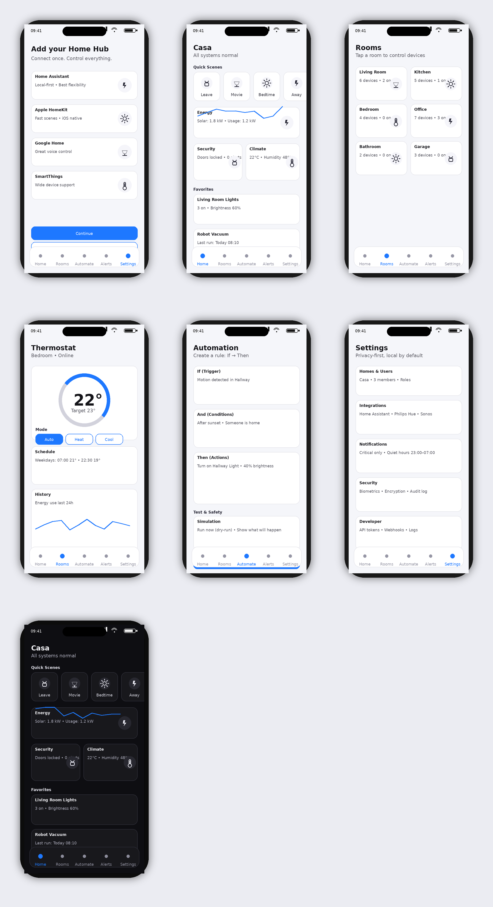

# Casa - Smart Home Control App

A unified, privacy-focused mobile app for controlling smart home devices across multiple ecosystems, with first-class Home Assistant support.



## Overview

Casa is a .NET MAUI mobile application designed to provide a single, consistent interface for managing smart home devices from different brands. Built with privacy and performance in mind, it offers local-first control with optional cloud features.

## Features

### Core Functionality
- 🏠 **Unified Dashboard**: Quick access to scenes, status cards, and favorite devices
- 📱 **Room Management**: Organize devices by room with intuitive controls
- ⚡ **Automation Builder**: Create powerful if/then automations with safety rules
- 🚨 **Smart Alerts**: Critical notifications with recommended actions
- 👥 **Multi-User Support**: Role-based access control (Owner/Admin/Member/Guest)
- 🔒 **Security First**: Biometric authentication and encrypted storage
- 📡 **Offline Mode**: Cached state and action queuing when disconnected

### Supported Device Types
- 💡 Lights (brightness, color)
- 🔌 Switches & Plugs
- 🌡️ Climate Control (thermostats, HVAC)
- 🔐 Locks (with extra safety confirmations)
- 📊 Sensors (temperature, motion, etc.)
- 🎵 Media Players

## Architecture

### Technology Stack
- **Framework**: .NET MAUI 10.0
- **Platforms**: iOS, Android, macOS Catalyst
- **Pattern**: MVVM with dependency injection
- **State Management**: CommunityToolkit.Mvvm
- **API**: Home Assistant REST + WebSocket

### Project Structure
```
src/
├── Models/              # Data models
│   ├── Device.cs
│   ├── Room.cs
│   ├── Scene.cs
│   ├── Automation.cs
│   ├── Alert.cs
│   ├── Home.cs
│   └── User.cs
├── Services/            # Business logic
│   ├── HomeAssistantService.cs
│   └── DataService.cs
├── ViewModels/          # View logic
│   ├── HomeViewModel.cs
│   ├── RoomsViewModel.cs
│   ├── AutomateViewModel.cs
│   ├── AlertsViewModel.cs
│   └── OnboardingViewModel.cs
├── Views/               # UI pages
│   ├── HomePage.xaml
│   ├── RoomsPage.xaml
│   ├── AutomatePage.xaml
│   ├── AlertsPage.xaml
│   ├── SettingsPage.xaml
│   ├── OnboardingPage.xaml
│   └── RoomDetailPage.xaml
└── Converters/          # Value converters
    └── Converters.cs
```

## Getting Started

### Prerequisites
- .NET 10.0 SDK
- Visual Studio 2022 or Visual Studio Code
- Xcode (for iOS/macOS)
- Android SDK (for Android)
- Home Assistant instance with long-lived access token

### Installation

1. Clone the repository:
```bash
git clone https://github.com/yourusername/SmartHouse.git
cd SmartHouse
```

2. Restore dependencies:
```bash
dotnet restore src/SmartHouse.csproj
```

3. Build the project:
```bash
dotnet build src/SmartHouse.csproj
```

4. Run on your preferred platform:
```bash
# iOS
dotnet build src/SmartHouse.csproj -t:Run -f net10.0-ios

# Android
dotnet build src/SmartHouse.csproj -t:Run -f net10.0-android

# macOS
dotnet build src/SmartHouse.csproj -t:Run -f net10.0-maccatalyst
```

### Configuration

1. Launch the app
2. On the onboarding screen, enter your Home Assistant URL (e.g., `http://192.168.1.100:8123`)
3. Enter your long-lived access token from Home Assistant
4. Tap "Connect" to test the connection
5. Start controlling your devices!

#### Getting a Home Assistant Token

1. Open your Home Assistant web interface
2. Click on your profile (bottom left)
3. Scroll to "Long-Lived Access Tokens"
4. Click "Create Token"
5. Give it a name (e.g., "Casa App")
6. Copy the token and paste it into the app

## Usage

### Navigation
The app uses a bottom tab bar with 5 main sections:

1. **Home**: Dashboard with quick actions and status overview
2. **Rooms**: Browse devices organized by room
3. **Automate**: Manage and create automations
4. **Alerts**: View critical alerts and activity log
5. **Settings**: Configure app preferences and integrations

### Creating an Automation

1. Navigate to the "Automate" tab
2. Tap "Create Automation"
3. Choose a trigger (time, device state, etc.)
4. Add conditions (optional)
5. Add actions (device controls)
6. Configure safety rules (cooldown, quiet hours)
7. Save and enable

### Managing Users

1. Go to Settings → Users & Access
2. Add family members with appropriate roles:
   - **Owner**: Full access to everything
   - **Admin**: Manage devices and automations
   - **Member**: Control devices
   - **Guest**: View-only access
3. Restrict sensitive domains (locks, alarms) by role

## Development

### Adding a New Feature

1. Create model in `Models/` if needed
2. Add service methods in `Services/`
3. Create ViewModel in `ViewModels/`
4. Design UI in `Views/`
5. Register in `MauiProgram.cs`

### Code Style
- Use C# 12 features
- Follow MVVM pattern
- Async/await for all I/O operations
- Dependency injection for services
- XML documentation for public APIs

### Testing
```bash
dotnet test
```

## Roadmap

See [PRD.md](PRD.md) for detailed roadmap and acceptance criteria.

### Phase 1 (MVP) - Current
- ✅ Basic app structure
- ✅ Home Assistant connection
- ✅ Dashboard, Rooms, Automations, Alerts, Settings
- ⏳ WebSocket real-time updates
- ⏳ Offline mode
- ⏳ Biometric authentication

### Phase 2 (Q1 2025)
- Advanced automation templates
- Device history graphs
- Custom dashboards
- Enhanced notifications

### Phase 3 (Q2 2025)
- HomeKit bridge integration
- Energy analytics
- Video camera support
- Voice control

## Contributing

Contributions are welcome! Please read our contributing guidelines and code of conduct.

1. Fork the repository
2. Create a feature branch
3. Make your changes
4. Submit a pull request

## Privacy & Security

- **Local-first**: All device control happens on your local network
- **No tracking**: No analytics unless you opt-in
- **Encrypted storage**: Sensitive data encrypted at rest
- **Biometric auth**: Face ID / Touch ID for app access
- **Secure tokens**: Access tokens stored in platform keychain

## License

This project is licensed under the MIT License - see LICENSE file for details.

## Acknowledgments

- Home Assistant community for excellent API documentation
- .NET MAUI team for the cross-platform framework
- Contributors and beta testers

## Support

- 📧 Email: support@casaapp.com
- 🐛 Issues: GitHub Issues
- 💬 Community: Discord Server
- 📖 Docs: https://docs.casaapp.com

---

Built with ❤️ for smart home enthusiasts
